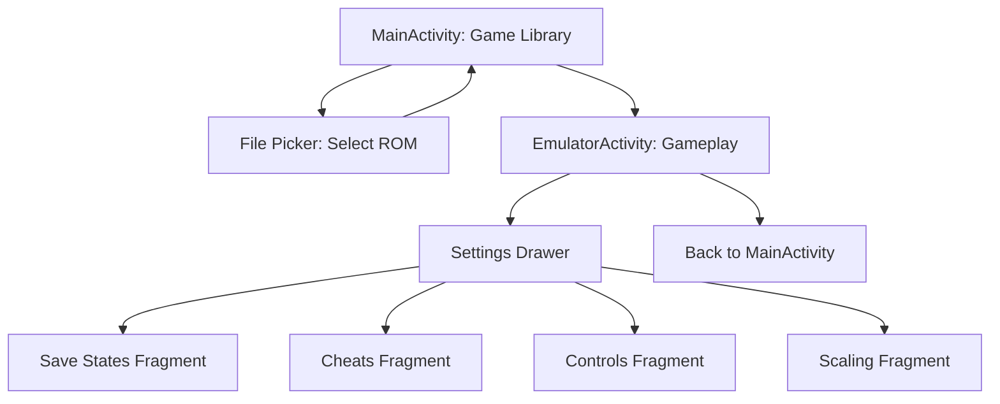

# UI Architecture Design for NES Emulator Android App

## Overview
The NES emulator app features a clean, responsive user interface designed for Android devices. It consists of two main activities: MainActivity for the game library and EmulatorActivity for gameplay. Settings are managed through fragments in a navigation drawer. The design integrates with RetroCore for emulation, handling input, video, and audio.

## Activities and Layouts

### 1. MainActivity: Game Library
- **Purpose**: Display a list or grid of available ROMs, allowing users to select and launch games.
- **Layout**:
  - Top: Toolbar with app title and settings icon.
  - Main: RecyclerView (RecyclerView) configured for both list and grid modes.
    - Toggle button in toolbar to switch between list (vertical) and grid (2-3 columns).
    - Each item: CardView with game name, optional thumbnail (from ROM metadata or default icon).
  - Bottom: Floating Action Button (FAB) to add ROMs via Android file picker.
- **UI Components**:
  - RecyclerView with custom adapter.
  - CardView for items.
  - Toolbar with menu.
  - FAB for ROM addition.
- **Functionality**:
  - Scan for ROMs in selected directories.
  - On item click: Start EmulatorActivity with ROM path as intent extra.
- **Responsive**: Use GridLayoutManager for grid, LinearLayoutManager for list. Adjust columns based on screen width.

### 2. EmulatorActivity: Gameplay
- **Purpose**: Render the game using GLSurfaceView and provide overlay controls for input.
- **Layout**:
  - Full-screen FrameLayout.
  - GLSurfaceView as base layer for game rendering.
  - Overlay: RelativeLayout with virtual buttons.
    - D-pad (cross-shaped ImageButton) on left.
    - A and B buttons (ImageButtons) on right.
    - Start and Select buttons (Buttons) at bottom center.
  - Top: Menu button to open navigation drawer for settings.
- **UI Components**:
  - GLSurfaceView for video output.
  - ImageButtons and Buttons for controls.
  - DrawerLayout with NavigationView for settings fragments.
- **Functionality**:
  - Initialize RetroCore, load selected ROM.
  - Run emulation loop, updating GLSurfaceView.
  - Map touch events to NES inputs via RetroCore.setInputState().
  - Handle pause/resume for lifecycle.
- **Responsive**: Buttons scale with screen size. Landscape: adjust positions. GLSurfaceView fits screen with scaling options.

### 3. Settings: Fragments in Navigation Drawer
- **Purpose**: Provide menus for save states, cheats, controls customization, and scaling options.
- **Layout**: NavigationView in DrawerLayout, hosting fragments.
- **Fragments**:
  - **Save States**: ListView of save slots (e.g., 10 slots). Buttons to save/load. Integrate with RetroCore.retroSerialize/Unserialize.
  - **Cheats**: ListView of cheat codes. Toggle switches. Use RetroCore.retroCheatSet.
  - **Controls**: Customizable positions for overlay buttons. Sliders for sensitivity. Save preferences.
  - **Scaling**: RadioGroup for options: Fit Screen, Maintain Aspect Ratio, Pixel Perfect. Apply to GLSurfaceView scaling.
- **UI Components**:
  - ListView, Switches, Sliders, RadioButtons.
  - SharedPreferences for persistence.
- **Navigation**: Drawer opens from EmulatorActivity menu button.

## Navigation Flow
- **App Launch**: MainActivity displays game library.
- **ROM Selection**: File picker (Intent.ACTION_GET_CONTENT) to select .nes files. Add to library (persist paths).
- **Launch Game**: Intent to EmulatorActivity with ROM path.
- **In-Game**: Overlay controls for input. Menu button opens settings drawer.
- **Back**: Standard back stack. From EmulatorActivity to MainActivity on back press.

## Responsive Design
- **Screen Sizes**: Use ConstraintLayout for flexible positioning. Define dimensions in dp, use wrap_content/match_parent.
- **Orientations**: Separate layouts for portrait/landscape (e.g., activity_emulator_land.xml).
- **Densities**: Vector drawables for buttons. Scale factors for different densities.
- **Accessibility**: Content descriptions for buttons. High contrast options.

## Integration with RetroCore
- **Lifecycle**: In EmulatorActivity.onCreate: RetroCore.retroInit(), retroLoadGame().
- **Rendering**: GLSurfaceView.Renderer to call RetroCore.retroRun(), update texture from video data.
- **Input**: OnTouchListener on buttons: Map to NES device IDs, call RetroCore.setInputState().
- **Audio**: Separate thread for RetroCore.retroGetAudioSampleBatch(), feed to AudioTrack.
- **Save/Cheats**: Direct calls to RetroCore methods.

## Diagrams

### App Navigation Flow


### EmulatorActivity Layout Sketch
```
+-----------------------------+
| Menu Button |               |
+-----------------------------+
|                             |
|        GLSurfaceView        |
|       (Game Rendering)      |
|                             |
+-----------------------------+
| D-Pad     |   A   B         |
|           | Start Select    |
+-----------------------------+
```

## Summary
This UI architecture provides an intuitive, performant interface for the NES emulator. MainActivity handles ROM management, EmulatorActivity focuses on gameplay with overlay controls, and settings are accessible via a drawer. Responsive design ensures compatibility across devices. Integration with RetroCore enables seamless emulation, with input mapped to virtual controls and video rendered via GLSurfaceView.